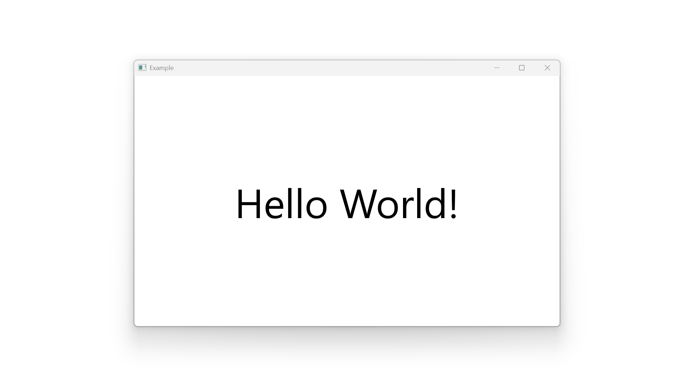
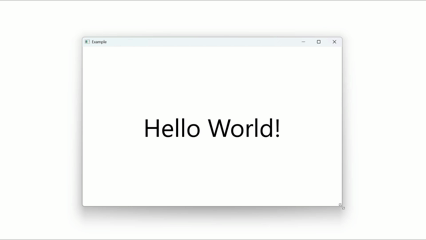
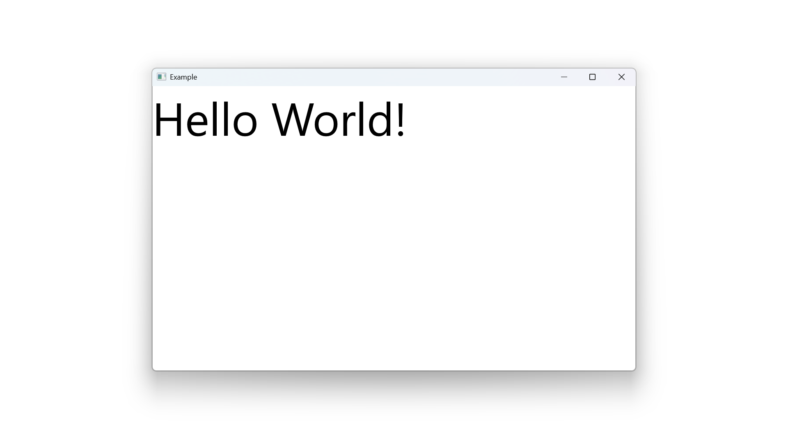
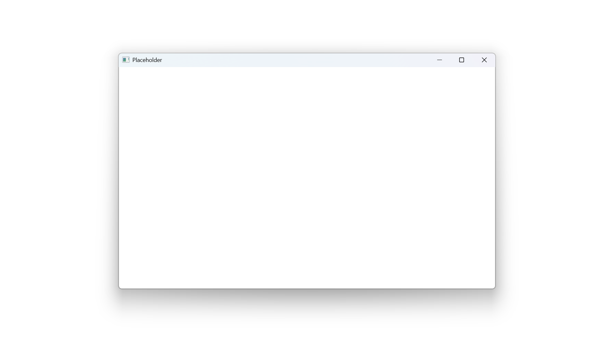

# ViewDesign

A C++ GUI framework

## Introduction

*ViewDesign* is a general-purpose, object-oriented, highly modular, minimal and flexible cross-platform C++ GUI framework with multi-backend support. It ships with an easily extensible component library for explicit and intuitive UI building, featuring compile-time layout compatibility check via C++ concepts, which is particularly helpful for designing complex UI components with minimal runtime overhead.

### Highlight

(core library of *ViewDesign*)
- a single static library in native C++, built with CMake (using standard C++23)
- cross-platform, with multi-backend support
- easy to setup and integrate, no boilerplate, no special tooling
- minimal, clear and efficient logic for component management, layout calculation and rendering
- intrinsically DPI-aware
- fit for both 'immediate-mode' and 'retained-mode' GUI programming, supporting hot reload with ease (see example [HotReload](Example/HotReload.cpp))

(standard component library of *ViewDesign*, bundled together with the core library)
- object-oriented, modular and extensible
- conceptual separation of components as *control*, *frame* and *layout*
- explicit declaration of component layout with **size traits**
- compile-time check of layout compatibility between components

### Example

> The example section demonstrates the standard component library of *ViewDesign* with size traits. The core library, however, can be easily customized and extended by other means.

The program below displays "Hello World!" at the center of the main window: ([Example/HelloWorld.cpp](Example/HelloWorld.cpp))

```cpp
#include <ViewDesign/view/widget/DefaultWindow.h>
#include <ViewDesign/view/frame/CenterFrame.h>
#include <ViewDesign/view/control/TextView.h>

using namespace ViewDesign;

struct TextViewStyle : TextView::Style {
	TextViewStyle() {
		font.size(75.0f).color(ColorCode::Black);
	}
};

void App() {
	desktop.AddWindow(
		create<DefaultWindow>(
			DefaultWindow::Style(),
			u"Example",
			create<CenterFrame<Fixed, Fixed>>(
				create<TextView>(TextViewStyle(), u"Hello World!")
			)
		)
	);
	desktop.EventLoop();
}
```



We first include headers of the components, then we define text style for `TextView` derived from the default style, and finally in the entrypoint `void App()`, we create and combine the components, add main window `DefaultWindow` and enter event loop.

`CenterFrame<Fixed, Fixed>` always places `TextView` at the center when it is being resized:



If we change it to `ClipFrame<Fixed, Fixed, TopLeft>`, the `TextView` will stay at the top-left corner.

```cpp
// #include <ViewDesign/view/frame/ClipFrame.h>

	desktop.AddWindow(
		create<DefaultWindow>(
			DefaultWindow::Style(),
			u"Example",
			create<ClipFrame<Fixed, Fixed, TopLeft>>(
				create<TextView>(TextViewStyle(), u"Hello World!")
			)
		)
	);
```



Similarly, `ClipFrame<Fixed, Fixed, TopRight>`, `ClipFrame<Fixed, Fixed, BottomLeft>` and `ClipFrame<Fixed, Fixed, BottomRight>` place their child views at top-right, bottom-left and bottom-right corners respectively.

`Fixed` is one of the size traits of a view, marking that a dimension (width or height) is to be assigned by the parent view. `DefaultWindow` expects both width and height of the child view to be `Fixed`, therefore, we wrote `CenterFrame<Fixed, Fixed>` or `ClipFrame<Fixed, Fixed, TopLeft>`, etc. We can not directly put a `TextView` in `DefaultWindow`, because both width and height of a `TextView` are not `Fixed`, but `Relative`, and the code below won't compile:

```cpp
	desktop.AddWindow(
		create<DefaultWindow>(
			DefaultWindow::Style(),
			u"Example",
			create<TextView>(TextViewStyle(), u"Hello World!") // error: size traits incompatible
		)
	);
```

The size of a `TextView` depends on both the size constraint provided by its parent view and its text content, thus it has `Relative` traits. Because its size might not exactly be the same as `DefaultWindow`, `DefaultWindow` doesn't know how to place it inside. `CenterFrame<Fixed, Fixed>` can be used as an adapter in between, which itself has `Fixed` traits that fits with `DefaultWindow`, while accepting a child view with `Relative` traits and placing the child view at its center.

A simpler program below displays an empty main window: ([Example/Placeholder.cpp](Example/Placeholder.cpp))

```cpp
#include <ViewDesign/view/widget/DefaultWindow.h>
#include <ViewDesign/view/control/Placeholder.h>

using namespace ViewDesign;

void App() {
	desktop.AddWindow(
		create<DefaultWindow>(
			DefaultWindow::Style(),
			u"Placeholder",
			create<Placeholder<Fixed, Fixed>>()
		)
	);
	desktop.EventLoop();
}
```



`DefaultWindow` always expects a child view with `Fixed` traits to be given. `Placeholder<Fixed, Fixed>` here works literally as a placeholder of the child view that draws nothing and can be replaced later.

`create<>` is just a shorter alias of `std::make_unique<>`. We can also use the even shorter `new` here to create the components, and it will not be unsafe because the raw pointer returned by `new` will be immediately captured as a `unique_ptr` internally in the parent view constructors.

```cpp
	desktop.AddWindow(
		new DefaultWindow(
			DefaultWindow::Style(),
			u"Example",
			new CenterFrame<Fixed, Fixed>(
				new TextView(TextViewStyle(), u"Hello World!")
			)
		)
	);
```

Another advantage of using plain `new` is that it well supports template parameter deduction guide for specific parent view components without having to explicitly provide the template arguments, while with `create<>` the parent view's template arguments must be fully given (see [Example/Background.cpp](Example/Background.cpp)). However, for *layout* components like `ListLayout`, `DivideLayout` and `StackLayoutMultiple` that accept variable number of child views, passing a child view as raw pointer is not allowed to ensure exception-safety.

UTF-16 strings are used across this project. Prefix `u` is for declaring UTF-16 string literals.

More examples can be found in subfolder [Example](Example) which are built along with the library. They include:
- [BackgroundWrapper](Example/BackgroundWrapper.cpp): adding background to a view component
- [Canvas](Example/Canvas.cpp): drawing random shapes on a blank window
- [ImageView](Example/ImageView.cpp): displaying an image with different stretch modes controlled by different frames
- [PlainTextEditor](Example/PlainTextEditor.cpp): a plain-text editor supporting word-/paragraph- level selection, copy/paste and IME input
- [TitleBarWindow](Example/TitleBarWindow.cpp): a customized window frame with title bar, border, buttons, etc
- [StateMirroring](Example/StateMirroring.cpp): duplicating the text state of a text editor to other text views
- [ViewMirroring](Example/ViewMirroring.cpp): duplicating the exact drawing content of a view component
- [HotReload](Example/HotReload.cpp): immediate-mode rendering with support of hot reload
- [SceneEmbedding (Vulkan)](Example/vulkan/SceneEmbedding.cpp): embedding a custom 3D-scene in a view component

### Build

*ViewDesign* is a single static library that can be built with CMake by various compilers targeting multiple backends cross-platform. The currently supported backends and platforms are:
- `Win32-DirectX` (Windows)
- `Win32-OpenGL` (Windows)
- `Win32-Vulkan` (Windows)
- `GLFW-OpenGL` (Windows, Linux)
- `GLFW-Vulkan` (Windows, Linux)

On Windows, *ViewDesign* with `Win32-DirectX` backend can be directly built by Visual Studio as a CMake project. [Building ViewDesign](docs/build.md) provides more detailed instructions on configuring and building *ViewDesign* with different backends and platforms.

> Due to complexities, `-OpenGL/Vulkan` backends are not yet natively equipped with text rendering capabilities for a `TextView` component, with which text characters are presented as placeholder rectangles. Nevertheless, *ViewDesign* exposes the necessary OpenGL/Vulkan contexts, helper functions and examples so that one could custom implement drawing texts or other complex 2D shapes with third-party 2D graphics libraries, like *Skia*.

### Principle

Being complex is easy, but being simple yet equally functional is hard. Having undergone multiple revisions and refactorings, *ViewDesign* aims to be simple, modular and transparent while maintaining high functionality. There is no hidden logic or global context, and it is easy to inspect and modify any part of the library code. The files of the library are well structured, self-explanatory and effortless to navigate. Each file is kept possibly small and independent for a single component, mostly within ~100 lines. There is no all-in-one header and each component header is to be included individually on demand. This results in better develop-time, compile-time and runtime efficiency.

The example section above demonstrates the components like `TextView`, `CenterFrame`, etc with size traits in the standard component library of *ViewDesign*. The core library (excluding components in subfolders of [ViewDesign/view](ViewDesign/view) and `view_traits.h`), however, does not enforce size traits, component styles or any development paradigm. It can be integrated with any project in any C++ design patterns and extended with any custom component libraries to fit special development needs. The standard components provided along with the core library are such examples that can be directly used, inherited, or taken as models for developing custom components.

### Comparison

GUI programming in C++ is historically chaotic compared with other programming languages. There was no official GUI framework in the standard library of C++, and third-party frameworks have their own strengths and limitations, which are often not ideal for general-purpose GUI development. *ViewDesign* aims for unifying GUI programming in C++ by taking advantages of modern C++ features like RAII, templates and concepts, offering a new approach to design and develop GUI programs in a broader context.

The features and benefits of *ViewDesign* can be demonstrated by comparing with other popular GUI frameworks.

#### Web Development with HTML/CSS/JavaScript

In web development, elements, styles and event handling are described separately by HTML, CSS and Javascript which can get distracting, complicate the development and affect the performance. With *ViewDesign*, they can be all implemented in pure C++ which directly compiles to machine code targeting desktop applications. One can still choose to separate style definitions and main logics in different files at will.

In web development, each element consists of padding, border and margin along with its content according to the CSS box model, which makes it easy to design and change the style of an element but also makes an element unnecessarily large to store all the style information. In the standard component library of *ViewDesign*, a *control* component is aimed to be minimal and lightweight without additional decorations. For example, the `TextView` just displays text within a given size constraint without any border, padding, background color or layout styles. It can however be combined with other *frame* components like `CenterFrame`, `BorderFrame`, `PaddingFrame` or `MaxFrame` to implement such additional styling attributes.

In web development, the layout styles of parent and child elements can be conflicting. For example, a parent element might have style `width: fix-content` while its child element has style `width: 100%`, which doesn't make sense. With the standard component library of *ViewDesign*, this scenario can be prevented at compile-time when parent view expects the width trait of its child view to be `Auto` but child view's width trait is `Fixed`. This usually encourages developers to think about the sizing behaviour of a component and the layout compatibility between components. Nevertheless, there remains the possibility of building a general-purpose, style-guided and at runtime calculated rich component like an HTML-element on top of the core *ViewDesign* library. In other words, *ViewDesign* can provide a basis for a browser engine.

#### Win32 Desktop Development

With native Win32 API, each component is treated as a window and can be created with different pre-defined styles through low-level system APIs, with which it is difficult to develop and manage complex and custom UI components. Though *ViewDesign* still internally relies on Win32 API for its `Win32-` backends, it only creates one root-level window for presenting and receiving system messages, while the content of the window is completely managed and drawn by the framework itself.

Other Win32-targeting GUI frameworks like MFC, WPF or WinUI evolve to align more with object-oriented design, but they are not cross-platform, rely on special development tools, focus rather on the styling and component library without providing much extensibility.

#### Qt

Qt provides multiple frameworks and rich tool sets for cross-platform GUI and software development in general under a large community. *ViewDesign* is a single static C++ library which is extremely lightweight without the need of a particular development environment but remains highly flexible and extensible.

Qt uses size policy to similarly describe how a widget is to be resized as size traits, but this is rather a suggestion that is performed by certain layout boxes at runtime, than an enforced compatibility check. In the standard component library of *ViewDesign*, size traits are built-in for all components to check layout compatibilities and catch ill-combined components at compile-time and are stripped away after compilation, leaving no runtime overhead. Moreover, they can be used to automatically select the compatible specialization of templated *frame* and *layout* components like `BorderFrame`, `ScrollFrame`, `SplitLayout` or `ListLayout` with help of C++ template deduction guide, making it seamless to build up well-formed view components with little effort.

Qt uses signals and slots mechanism historically for communication between objects that extends the C++ language. *ViewDesign* sticks to native C++, provides multiple optional mechanisms for messaging like `Observable` and `Context` as standalone headers for developers to choose, and is open to all kinds of custom design patterns.

#### Dear ImGui

Dear ImGui markets itself as an 'immediate-mode' GUI library for engine developers that is easy to integrate with existing render loops for displaying tools. It is single-header-based with various pre-defined components that can be used via imperative programming. It internally maintains input states in a global context and tracks component states with an ID system, while the user-side code only stores the data referenced by the components without having to explicitly manage the component tree as with traditional 'retained-mode' GUI programming.

However, by discarding an object-oriented and functional design, it is more difficult and error-prone with ImGui to deal with scopes, implement complex layout dependencies and to extend the components to fit custom needs. In *ViewDesign* which is particularly layout-sensitive, it is necessary to still take the object-oriented approach utilizing C++ features, ensuring precise management of scopes and easing the building of custom components to fit complex layout calculation and rendering needs.

Being object-oriented doesn't immediately mean being equal to a traditional 'retained-mode' GUI framework. With *ViewDesign*, it is possible to implement both 'immediate-mode' and 'retained-mode' rendering loops for supporting hot reload. While in retained mode the components are designed to persist across rendering frames with their states stored internally, in immediate mode they are designed to be reconstructible every frame from externally persistent states. This relies rather on the choice of the component library than on the core *ViewDesign* framework itself. Though the standard component library of *ViewDesign* by default still aligns more with retained-mode GUI programming, it is not difficult to develop corresponding stateful versions of  components for immediate-mode GUI programming. (see example [HotReload](Example/HotReload.cpp))

### Limitation

The backends, examples, documentation and the standard component library of *ViewDesign* are currently still being extended. Extensive correctness and performance testing targeting multiple platforms are also needed.

**Contribution to this project is therefore very welcome!**

### Summary

*ViewDesign* is a general-purpose C++ GUI framework that is easily maintainable, modifiable, adaptive and extensible due to its exceptional modularity and abstraction. The compile-time layout compatibility check of components introduced in the standard component library of *ViewDesign* could take some mental effort to adapt with, but its benefits are enormous. It provides a modern and clean approach for designing GUI applications, and is well-suited for learning purposes and for verifying prototypes and ideas.

## Concepts

This section introduces the basic concepts and algorithms related with view tree, layout, drawing and event handling in *ViewDesign*.

### View / Desktop / Window

A view is a component derived from `ViewBase` defining its own logic of calculating layout, drawing content and handling events.

Each view can have a parent view and multiple child views. All views form a view tree.

`Desktop` is the virtual root of the view tree that manages all windows of the program on the system desktop. Each `Window` as a direct child view of `Desktop` presents one window and receives system events for this window.

### Control / Frame / Layout

*Control*, *frame* and *layout* are different types of view components in the standard component library of *ViewDesign*.

- A *control* has no child view and does basic functions or displays raw content, like `Placeholder`, `TextView`, `ImageView`, etc.

- A *frame* has one child view to decorate, like `BorderFrame`, `BackgroundFrame`, `CenterFrame`, etc.

- A *layout* may have multiple child views that are visually arranged in certain layouts, like `ListLayout`, `StackLayout`, `SplitLayout`, `OverlapLayout`, etc.

### Reflow / Redraw

Each view component occupies a rectangular region on its parent view. Usually the position of a view is decided by the parent view completely, but the size of a view can be decided by both the view itself and its parent view.

*Reflow* is the process of propagating size change and calculating the layout of a view component, determining the size of the view and the sizes and positions of child views. *Redraw* is the process of propagating an updated region of a view component and rendering the updated region with new contents.

In the core library, regardless of size traits, the parent view provides a size reference `size_ref` to a child view, the child view calculates its size based on the `size_ref` or on its own, and returns its actual size to the parent view, which then calculates its own layout and size.

If a view later changes its size by itself, it notifies its parent view, and the parent view calculates its layout again and might also change its own size. Reflow stops at the first parent view who updated its internal layout but doesn't change its own size. This final parent view then initiates redraw over its updated region.

A view whose content is updated without size change can also initiate redraw. A view who changes its size doesn't have to initiate redraw because the final parent view will.

A view initiating redraw notifies its parent view about its updated region, and the parent view translates and clips the child view's region as its own and notifies its own parent view until the root-level `Window`, which then draws all child views in the updated region and presents the window in the next rendering frame.

### Fixed / Auto / Relative

The core library provides the generic logic for updating layout of a view, but the parent and the child view's layout calculation logic must be additionally ensured to agree with each other. For example, the parent view might want to fix the size of its child view as large as the `size_ref` provided to its child view, but the child view can ignore the `size_ref` and decide its own size. This often introduces ill-formed layouts, and the core library actually doesn't prevent this from happening.

The standard component library of *ViewDesign* introduces **size traits**: `Fixed`, `Auto` and `Relative` that mark how the width or the height of a view component is to be decided which can be checked at compile-time.

- `Fixed` means a dimension of a view is assigned by its parent view.

- `Auto` means a dimension of a view is determined by the view itself.

- `Relative` means a dimension of a view is finally calculated by the view but based on some information provided by its parent view.

`view_ref` holds a reference to a view, and `view_ptr` owns a unique pointer to a view. Both of them can be marked by certain size traits, and a parent view may only accept child views passed as `view_ref` or `view_ptr` with certain size traits. This will be checked through C++ concepts at compile-time.

Some *frame* components act as adapters for converting size traits of the child view:

- `ClipFrame`, `CenterFrame` and `ScrollFrame` convert a dimension of the child view from `Relative` to `Fixed`, clipping the overflowing part of the child view. `ClipFrame` puts the child view at a corner or to a side. `CenterFrame` puts the child view at the center. `ScrollFrame` makes it possible to scroll to the overflowing part of the child view. `StretchFrame` does the same trait conversion, though it stretches its child view to make it fit in itself.

- `FixedFrame` converts a dimension of the child view from `Fixed` to `Auto`. It sets a fixed value for the dimension of the child view.

- `MaxFrame` and `MinFrame` convert a dimension of the child view from `Relative` to `Auto`, normalizing its child view with a max or min size. `MaxFrame` is often combined with child view components with flowing behaviour, like `TextView`, by providing a max size constraint to the child view.

`Fixed` and `Auto` are naturally also `Relative`, but not vice versa. Therefore, `Relative` has the most freedom and the weakest restriction.

> How a view component with `Relative` traits or a parent view accepting a child view with `Relative` traits interpret the `size_ref` still depends on the components. For example, `TextView` has `Relative` traits and regards the `size_ref` as the size constraint for calculating the text layout, which agrees with `MaxFrame` that provides the `size_ref` as the max size constraint. However, another component with `Relative` traits may calculate its size as a percentage of `size_ref`, which usually won't work very well with `MaxFrame` even though it fits with `MaxFrame` by size traits. It is possible that more traits, like `Bounded`, could be proposed to further restrict the usage of `Relative`.

The reflow logic and the size traits already describe most scenarios of layout dependencies. Other more complex or special layout dependencies can be implemented by certain view components extending the core interfaces in a custom way. For example, a `Window` or an `OverlapLayout::Window` doesn't only decide its size, but also its position on the `Desktop` or the `OverlapLayout`, which is reflected by their extended interfaces.

### Figure / RenderTarget / Canvas / Surface / Layer

`Figure` is the unit for drawing. A figure can draw itself on a backend-dependent `RenderTarget`. Different figure types like `Line`, `Rectangle`, `TextBlock` and `Image` in the standard component library of *ViewDesign* all inherit the abstract `Figure` base class.

A `Canvas` is an abstract render target for view components. A view can draw its content as combinations of figures on the `Canvas` provided to it by its parent view. The `Canvas` can be further transformed to the coordinates relative to a child view and passed to the child view for it to draw on.

In the current implementation, the `Canvas` actually collects the figures drawn by the views with their positions in a flattened list, with a separate list marking group boundaries and transforms. It is then iterated over and rendered on the actual render target.

A `Surface` or a `Layer` can hold the actual backend-dependent render target for rendering a `Canvas`. A `Surface` is owned by a `Window` that is capable of presenting the window on the desktop. A `Layer` is an off-screen framebuffer that can render the figures and itself be composited as a `Figure` on another `Layer` or a `Surface`.

The component `LayerFrame` is provided in the standard component library of *ViewDesign* as a wrapper of `Layer` that can be directly inserted in the view tree, caching the rendered result of the subtree to avoid frequent redraws of its child views which are rather static during scrolling, etc.

### MouseEvent / KeyEvent / FocusEvent

A `Window` receives mouse events from the system and dispatches the events as instances of `MouseEvent` which includes the event type, the mouse position and key statuses. The view that consumes the mouse event is selected by hit test.

During hit test, each view checks the mouse event and returns a child view that should further process the event, or itself if it will consume the event, or a `nullptr` when a view is not found. The mouse position in the event is translated to the child view's coordinates.

If a view to consume the mouse event is finally found, this view is tracked by `Desktop` in a stack, and all parent views of the view and the view itself will be sent a `MouseEnter` event as `FocusEvent`. This view in addition will be sent a `MouseOver` event and then the original mouse event. If a view to consume the mouse event is not found, then the last view that processed the mouse event is still tracked and sent the `MouseEnter` event even though it won't be sent the `MouseOver` event and the original mouse event.

If the tracked view is changed on the next mouse event, the view tracked before will be sent a `MouseOut` event, and its parent views that are not parent of the newly tracked view will be sent a `MouseLeave` event.

If a view acquires mouse capture, all subsequent mouse events will be directly translated and sent to this view until it releases capture.

A view can acquire the focus to receive key events as instances of `KeyEvent`. This view is also tracked by `Desktop` in another similar stack, and all its parent views and the view itself will receive `FocusIn` event as `FocusEvent`, and the view itself will additionally receive `Focus` event. The view which owns the focus before will receive `Blur` event and its parent views that are not parent of the newly focused view will receive `FocusOut` event.

## Code Structure

This section gives an overview of the source code structure of *ViewDesign* with short descriptions for each module.

### common

The `common` subfolder includes some common type definitions and utility functions.

#### `Handle` / `ref_ptr` / `owner_ptr`

This project tries to avoid using raw pointers and prefers `std::unique_ptr` or `std::reference_wrapper` in most scenarios. But raw pointers are still useful sometimes for nullable references or holding special resources, and for accepting constructed view objects by the simpler `operator new`. Therefore, the alias for `void*`, `Handle`, and the two aliases for `T*`, `ref_ptr<T>` and `owner_ptr<T>` are defined in this project as a coding convention to mark and distinguish the usage of a raw pointer. As aliases, there is no actual safety check for these pointers and it is advised to use them only in a controlled manner.

#### `u16char` / `u16string`

In alignment with ICU (International Components for Unicode), UTF-16 strings are used in this project. `u16char` is an alias of `char16_t` and `u16string` an alias of `std::u16string`.

Converters between `std::u8string` and `std::u16string` are provided which depends on the ICU library. `reinterpret_cast` is used at platform boundaries for casting between `char16_t*` and `wchar_t*` (Windows), and between `char8_t*` and `char*`.

### geometry

The `geometry` subfolder defines the following types in 2D geometry, which all hold floating-point values for a more precise calculation under scaling:
- `Point`
- `Size`
- `Rect`
- `Vector`
- `Scale`
- `Transform`

For `Window`, `Surface` and `Layer` that work with device pixels of a render target, integer values are used with the following types:
- `PointI`
- `SizeU`
- `RectI`

Converting functions from types with floating point values to types with integer values are provided as `Round`, `RoundUp` and `RoundDown`. Types with integer values naturally convert to types with floating point values.

### drawing

The `drawing` subfolder includes the following classes related with drawing and rendering:
- `Color`: color in BGRA format stored as a 32-bit integer
- `PixelBuffer`: CPU-side bitmap as a 2D array of `Color` pixels, which can be converted to `Bitmap` as a GPU-side texture
- `Figure`: abstract base class for figures
- `Canvas`: abstract render target for view components as a container of figures in groups
- `Bitmap`: GPU-side texture
- `Surface`: GPU-side surface for a window
- `Layer`: GPU-side off-screen framebuffer

The implementations of backend-dependent classes `Bitmap`, `Surface` and `Layer` are to be found in the `backend` subfolder.

### event

The `event` subfolder defines types related with events:
- `MouseEvent`
- `KeyEvent`
- `FocusEvent`
- `Ime`
- `Timer`

### system

The `system` subfolder defines common system interfaces related with:
- window
- event loop
- cursor
- clipboard

The backend-specific implementations are also to be found in the `backend` subfolder.

### style

The `style` subfolder defines the cursor style that is referenced by all view components. More styles related with layout, text and border for specific components can be found in the standard component library under `view/style`.

### view

The `view` subfolder defines classes `ViewBase`, `Window` and `Desktop`. It also contains the standard component library as `view_traits.h` and the subfolders.

[Standard Component Library of ViewDesign](docs/components.md) provides an overview of the standard component library.

#### ViewBase

`ViewBase` is the base class of view components. It defines the minimal interfaces for managing child views, updating layout, drawing content and handling events.

The two virtual functions handle top-down and bottom-up layout update respectively:
- `virtual Size OnSizeRefUpdate(Size size_ref)`
- `virtual void OnChildSizeUpdate(ViewBase& child, Size child_size)`

They are respectively initiated by the parent view and a child view by:
- `Size UpdateChildSizeRef(ViewBase& child, Size size_ref)`
- `void SizeUpdated(Size size)`

The two virtual functions handle top-down drawing and bottom-up redraw request respectively:
- `virtual void OnDraw(Canvas& canvas, Rect draw_region)`
- `virtual void OnChildRedraw(ViewBase& child, Rect child_redraw_region)`

They are respectively initiated by the parent view and a child view by:
- `void DrawChild(ViewBase& child, Point child_offset, Canvas& canvas, Rect draw_region)` (not clipping child region) or `void DrawChild(ViewBase& child, Rect child_region, Canvas& canvas, Rect draw_region)` (clipping child region)
- `void Redraw(Rect redraw_region)`

### messaging

The `messaging` subfolder provides optional messaging tools:
- `Observable` / `Observer` (class template):
  - `State` / `Watcher`
  - `Signal` / `Listener`
- `ContextProvider` / `Context`

#### Observable

Class template `Observable` and `Observer` provide a general way to notify data updates.

Because the `Observer` is usually stored in a parallel component, careful lifetime management of the `Observable` object is required to avoid null references.

##### State

`State` implements `Observable` that stores a value. All `Watcher` will get notified with the current value when the value is updated.

`StateRef` is similar to `State` but it only keeps the reference of the value which is stored and updated externally.

##### Signal

`Signal` also implements `Observable` but doesn't store any value. It is only used for signaling an event.

An example of using `StateRef` and `Signal` can be found in [StateMirroring](Example/StateMirroring.cpp).

#### Context

`Context` is meant to be used by view components in the view tree. A view can inherit `ContextProvider` to register itself as a discoverable context provider, and a descendant view can use `Context<ProviderViewClass>` to query a registered ancestor view by its class name across multiple levels in the view tree. This avoids explicitly passing the reference of the ancestor view down level by level.

Usually a view component won't move once it is added in the view tree, but this still can happen in certain realistic scenarios. With `Context::Get()`, the reference to the provider ancestor view component is cached and won't be automatically updated when the consumer view component is removed from the subtree of the provider. `Context::Drop()` can be explicitly called in this case to reset the reference to the provider. Alternatively, `Context::GetCurrent()` can be used which drops the cached reference and queries the current provider every time.

An example usage of Context can be found in [TitleBarWindow.h](ViewDesign/view/widget/TitleBarWindow.h).

### platform

The `platform` subfolder contains helper functions for each platform under its own namespace. These functions are to be referenced by the related backends and custom platform-specific logics.

### backend

The `backend` subfolder contains backend-specific implementations of rendering and system interfaces.

## Todo

A to-do list for future development plans can be found in [To Do](docs/todo.md).

Feedback, suggestions, and issue reports are welcome!

## License

*ViewDesign* is licensed under the MIT license. (see [LICENSE](LICENSE))

## About

The development history of *ViewDesign*, my thoughts during the development, sponsorship options and a little more about myself are to be found in [About](docs/about.md).
